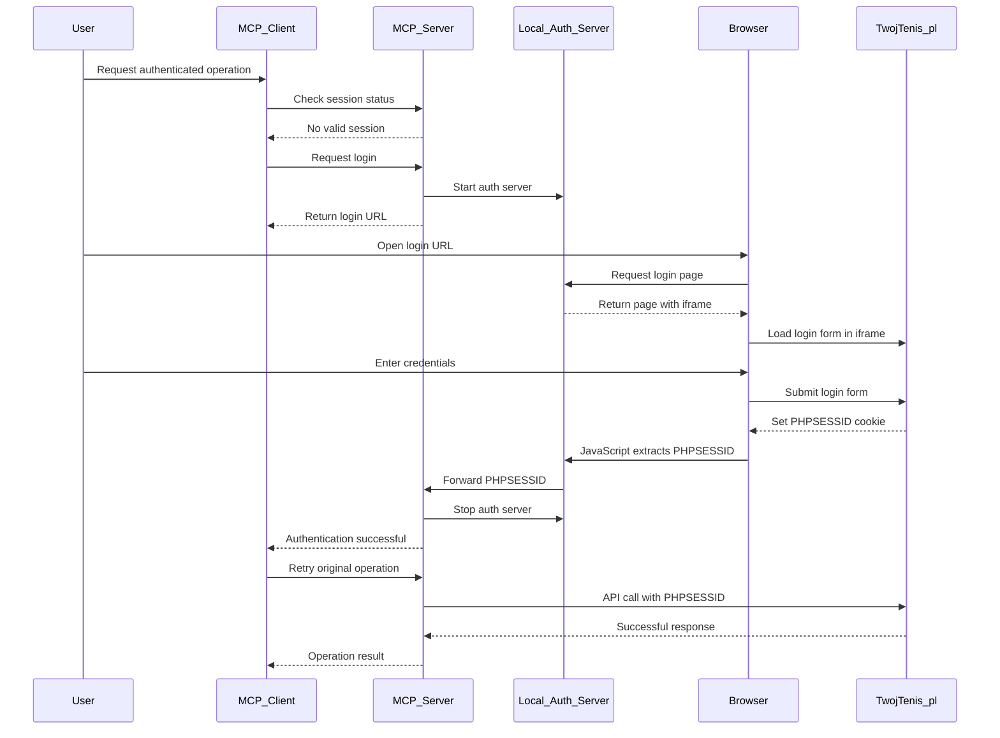

# OAuth-like Authentication Flow Architecture for TwojTenis.pl MCP Server

## Overview

This document outlines the architecture for implementing an OAuth-like authentication flow for the TwojTenis.pl MCP server that eliminates the need to store user credentials while maintaining secure session management.

## Current System Analysis

### Existing Authentication Flow
1. User credentials (email/password) are stored in configuration files or environment variables
2. MCP server uses these credentials to authenticate with twojtenis.pl
3. Server receives and stores PHPSESSID cookie for 120 minutes
4. All subsequent API calls include the PHPSESSID cookie
5. Session expires after 120 minutes and requires re-authentication

### Problems with Current Approach
- User credentials are stored in plain text configuration
- Security risk if configuration files are compromised
- No separation between MCP server and user authentication
- Automatic credential refresh without user consent

## Proposed OAuth-like Authentication Flow

### Architecture Components

1. **Local Authentication Server** - A lightweight web server running on localhost
2. **Login Page with Iframe** - A web page that embeds the twojtenis.pl login form
3. **Cookie Capture Mechanism** - JavaScript code to extract PHPSESSID from the iframe
4. **Session Manager** - Modified to handle the new authentication flow
5. **MCP Authentication Tools** - New MCP tools for login initiation and session management

### Authentication Flow Diagram



## Technical Implementation Details

### 1. Local Authentication Server

**File**: `src/twojtenis_mcp/auth_server.py`

- Lightweight HTTP server using Python's `http.server` or FastAPI
- Runs on a random available port (e.g., 8080-8090 range)
- Serves the login page and handles cookie capture
- Automatically shuts down after successful authentication

**Key Features**:
- Generate unique state tokens for security
- Serve login page with embedded iframe
- Receive PHPSESSID from JavaScript
- Communicate with main MCP server
- Handle timeout and cleanup

### 2. Login Page with Iframe

**Files**: 
- `src/twojtenis_mcp/templates/login.html`
- `src/twojtenis_mcp/static/auth.js`

**HTML Structure**:
```html
<!DOCTYPE html>
<html>
<head>
    <title>TwojTenis.pl Authentication</title>
</head>
<body>
    <h1>TwojTenis.pl Login</h1>
    <p>Please log in to TwojTenis.pl in the iframe below:</p>
    <iframe src="https://www.twojtenis.pl/pl/login.html" 
            width="100%" height="600" id="login-frame"></iframe>
    <div id="status">Waiting for authentication...</div>
    <script src="/static/auth.js"></script>
</body>
</html>
```

**JavaScript Cookie Capture**:
```javascript
// Monitor iframe for successful login
document.getElementById('login-frame').onload = function() {
    try {
        // Attempt to access cookies (may be blocked by same-origin policy)
        // Alternative: Monitor for URL changes indicating successful login
        const iframe = this.contentWindow || this.contentDocument;
        // Extract and send PHPSESSID to local server
    } catch(e) {
        // Handle cross-origin restrictions
        // Provide manual instructions as fallback
    }
};
```

### 3. Modified Session Manager

**File**: `src/twojtenis_mcp/auth.py` (updated)

**Changes**:
- Remove credential-based login
- Add methods for handling externally-provided PHPSESSID
- Implement session expiration detection
- Add re-authentication notification system

**New Methods**:
```python
async def save_external_session(self, phpsessid: str) -> None:
    """Save externally obtained session ID"""
    
async def is_session_expired(self) -> bool:
    """Check if current session is expired"""
    
async def request_reauthentication(self) -> str:
    """Initiate re-authentication flow"""
```

### 4. Updated MCP Client

**File**: `src/twojtenis_mcp/client.py` (updated)

**Changes**:
- Remove credential-based login methods
- Update error handling for session expiration
- Add re-authentication triggers

### 5. New MCP Authentication Tools

**File**: `src/twojtenis_mcp/server.py` (updated)

**New Tools**:
```python
@mcp.tool()
async def login() -> dict[str, Any]:
    """Initiate authentication flow"""
    
@mcp.tool()
async def get_session_status() -> dict[str, Any]:
    """Get current session status"""
    
@mcp.tool()
async def logout() -> dict[str, Any]:
    """Logout and clear session"""
```

### 6. Configuration Updates

**File**: `src/twojtenis_mcp/config.py` (updated)

**Changes**:
- Remove email/password requirements
- Add local server configuration options
- Add authentication flow settings

## Security Considerations

### 1. Same-Origin Policy Challenges
- Direct cookie access from iframe may be blocked by browser security
- Implement fallback mechanisms for manual cookie extraction
- Provide clear user instructions for alternative methods

### 2. Local Server Security
- Use random ports and state tokens
- Implement automatic server shutdown
- Validate all incoming requests

### 3. Session Management
- Secure storage of PHPSESSID in memory only
- Implement proper session expiration
- Clear session data on logout

## Fallback Mechanisms

### 1. Manual Cookie Extraction
If iframe approach fails due to browser restrictions:
1. Provide step-by-step instructions for manual cookie extraction
2. Create a simple form for users to paste their PHPSESSID
3. Validate the provided session ID before accepting

### 2. Browser Extension Approach
For advanced users:
1. Provide a simple browser extension
2. Extension can extract cookies and send to local server
3. More reliable but requires additional installation

## Implementation Phases

### Phase 1: Core Infrastructure
1. Create local authentication server
2. Implement basic login page
3. Modify session manager
4. Add basic MCP tools

### Phase 2: Cookie Capture
1. Implement iframe-based cookie capture
2. Add fallback manual input method
3. Test across different browsers

### Phase 3: Integration & Polish
1. Update all MCP tools to use new authentication
2. Add comprehensive error handling
3. Create documentation
4. Full testing and validation

## Benefits of This Approach

1. **Enhanced Security**: No credential storage in configuration files
2. **User Control**: Users explicitly authenticate through their browser
3. **Separation of Concerns**: MCP server doesn't handle user credentials
4. **Transparency**: Users see exactly what's happening during authentication
5. **Flexibility**: Can adapt to changes in twojtenis.pl authentication system
6. **Standards Compliance**: Follows OAuth-like patterns familiar to developers

## Conclusion

This OAuth-like authentication flow provides a secure, user-friendly way to authenticate with twojtenis.pl without storing credentials in the MCP server configuration. While there are technical challenges related to browser security policies, the proposed fallback mechanisms ensure reliability across different environments.

The implementation maintains backward compatibility where possible and provides a clear migration path for existing users.