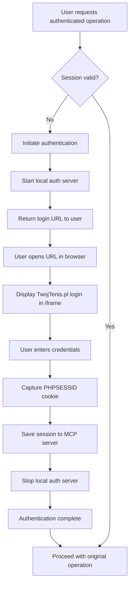

# OAuth-like Authentication for TwojTenis.pl MCP Server - Project Summary

## Project Goal

Implement an OAuth-like authentication flow for the TwojTenis.pl MCP server that eliminates the need to store user credentials while maintaining secure session management and user-friendly experience.

## Current State Analysis

### Existing System Issues
- **Security Risk**: User credentials stored in plain text configuration files
- **Poor User Experience**: Automatic credential refresh without user consent
- **Maintenance Burden**: Credential management and rotation
- **Compliance Concerns**: Storing credentials violates security best practices

### Target State Benefits
- **Enhanced Security**: No credential storage, only temporary session cookies
- **User Control**: Users explicitly authenticate through their browser
- **Transparency**: Clear authentication flow with user visibility
- **Standards Compliance**: OAuth-like pattern familiar to developers

## Solution Architecture

### Core Components

1. **Local Authentication Server**
   - Lightweight web server running on localhost
   - Serves login page with embedded TwojTenis.pl form
   - Handles session capture and validation
   - Automatic cleanup after authentication

2. **OAuth Flow Coordinator**
   - Manages authentication state and flow
   - Coordinates between MCP server and local auth server
   - Handles timeout and error scenarios
   - Provides user feedback and instructions

3. **Updated Session Manager**
   - Removes credential-based authentication
   - Handles externally-provided session IDs
   - Implements session expiration detection
   - Provides re-authentication triggers

4. **Enhanced MCP Tools**
   - `login()` - Initiate authentication flow
   - `complete_login()` - Complete authentication process
   - `get_session_status()` - Check authentication status
   - `logout()` - Clear session and logout

5. **User Interface**
   - Browser-based login page with iframe
   - Automatic session capture with manual fallback
   - Clear instructions and status indicators
   - Cross-browser compatibility

### Authentication Flow

## Implementation Plan

### Phase 1: Core Infrastructure (Priority: High)
- Create `auth_server.py` - Local authentication server
- Create `oauth_flow.py` - OAuth flow coordinator
- Update `auth.py` - Enhanced session manager
- **Estimated Effort**: 3-4 days

### Phase 2: User Interface (Priority: High)
- Create `templates/login.html` - Login page template
- Create `static/auth.js` - JavaScript cookie capture
- Implement manual fallback mechanisms
- **Estimated Effort**: 2-3 days

### Phase 3: Integration (Priority: High)
- Update `server.py` - New MCP tools
- Update `client.py` - Session expiration handling
- Update `config.py` - Remove credential requirements
- **Estimated Effort**: 2-3 days

### Phase 4: Testing & Refinement (Priority: Medium)
- Cross-browser compatibility testing
- Error handling and edge cases
- Performance optimization
- **Estimated Effort**: 2-3 days

### Total Estimated Effort: 9-13 days

## Technical Specifications

### Dependencies
- **FastAPI** - Local authentication server
- **uvicorn** - ASGI server for local auth
- **Existing dependencies** - No major changes required

### Configuration Changes
- **Removed**: `TWOJTENIS_EMAIL`, `TWOJTENIS_PASSWORD`
- **Added**: Optional auth server configuration
- **Backward Compatibility**: Graceful degradation for existing configs

### Security Considerations
- **Local-Only Communication**: Server bound to localhost
- **State Tokens**: CSRF protection with random tokens
- **Session Validation**: Proper expiration and validation
- **Secure Storage**: In-memory session storage when possible

## Risk Assessment

### High-Risk Items
1. **Cross-Origin Policy**: May block automatic cookie capture
   - **Mitigation**: Robust manual fallback with clear instructions

2. **Browser Compatibility**: Different behaviors across browsers
   - **Mitigation**: Comprehensive testing and browser-specific workarounds

### Medium-Risk Items
1. **TwojTenis.pl Changes**: Website updates could break integration
   - **Mitigation**: Flexible detection and minimal dependencies

2. **User Experience**: Complex flow may confuse users
   - **Mitigation**: Clear instructions and intuitive interface

### Low-Risk Items
1. **Local Server Issues**: Port conflicts or startup failures
   - **Mitigation**: Dynamic port allocation and error handling

## Success Criteria

### Functional Requirements
- [ ] Users can authenticate without storing credentials
- [ ] Sessions are captured automatically when possible
- [ ] Manual fallback works reliably
- [ ] Session expiration is handled gracefully
- [ ] All existing MCP functionality remains intact

### Non-Functional Requirements
- [ ] Authentication completes within 30 seconds
- [ ] System works on major browsers (Chrome, Firefox, Safari, Edge)
- [ ] No credential storage in configuration files
- [ ] Clear user instructions and error messages
- [ ] Backward compatibility with existing installations

### Security Requirements
- [ ] No persistent credential storage
- [ ] Secure session handling
- [ ] Protection against common web vulnerabilities
- [ ] Proper session expiration and cleanup

## Migration Strategy

### For Existing Users
1. **Communication**: Clear documentation about changes
2. **Graceful Migration**: Support both systems during transition
3. **Configuration Update**: Remove credentials from config files
4. **First-Time Setup**: Guide through new authentication flow

### For New Users
1. **Simplified Setup**: Minimal configuration required
2. **Clear Onboarding**: Step-by-step authentication guide
3. **Documentation**: Comprehensive user guide and troubleshooting

## Testing Strategy

### Unit Tests
- Authentication server functionality
- Session management operations
- OAuth flow coordination
- Error handling scenarios

### Integration Tests
- End-to-end authentication flow
- MCP tool integration
- Session expiration handling
- Cross-browser compatibility

### User Acceptance Tests
- Authentication success rates
- User experience metrics
- Task completion times
- Error recovery scenarios

## Documentation Plan

### Technical Documentation
- [x] Architecture design document
- [x] Implementation specification
- [x] Risk assessment and mitigation
- [ ] API documentation updates

### User Documentation
- [x] User guide with step-by-step instructions
- [ ] Troubleshooting guide
- [ ] Migration instructions
- [ ] FAQ and support information

## Next Steps

1. **Review and Approval**: Review this plan with stakeholders
2. **Resource Allocation**: Assign development resources
3. **Development**: Begin Phase 1 implementation
4. **Regular Reviews**: Weekly progress checkpoints
5. **Testing**: Comprehensive testing at each phase
6. **Deployment**: Gradual rollout with monitoring

## Conclusion

This OAuth-like authentication system provides a secure, user-friendly solution that eliminates the need to store user credentials while maintaining all existing functionality. The implementation is technically feasible, addresses security concerns, and provides a better user experience.

The phased approach allows for incremental development and testing, reducing risk while ensuring a robust final implementation. With proper planning and execution, this system can significantly improve the security posture of the TwojTenis.pl MCP server while enhancing user experience.

## Files Created

1. **auth_architecture.md** - Detailed architecture design
2. **implementation_plan.md** - Technical implementation specifications
3. **user_guide.md** - Comprehensive user documentation
4. **risk_assessment.md** - Risk analysis and mitigation strategies
5. **project_summary.md** - This executive summary

These documents provide a complete foundation for implementing the OAuth-like authentication system for the TwojTenis.pl MCP server.